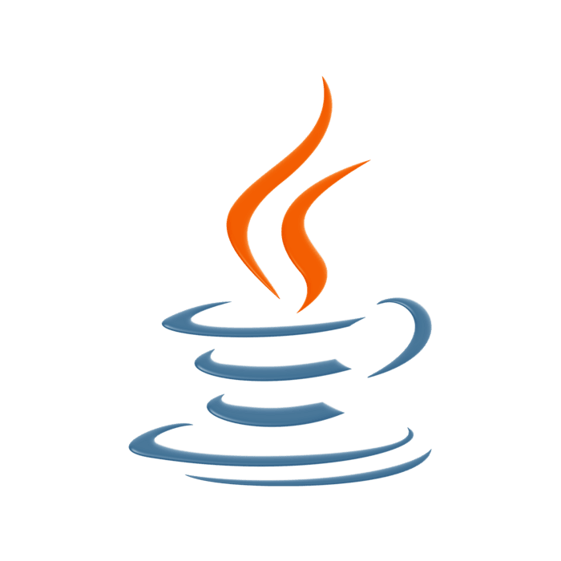
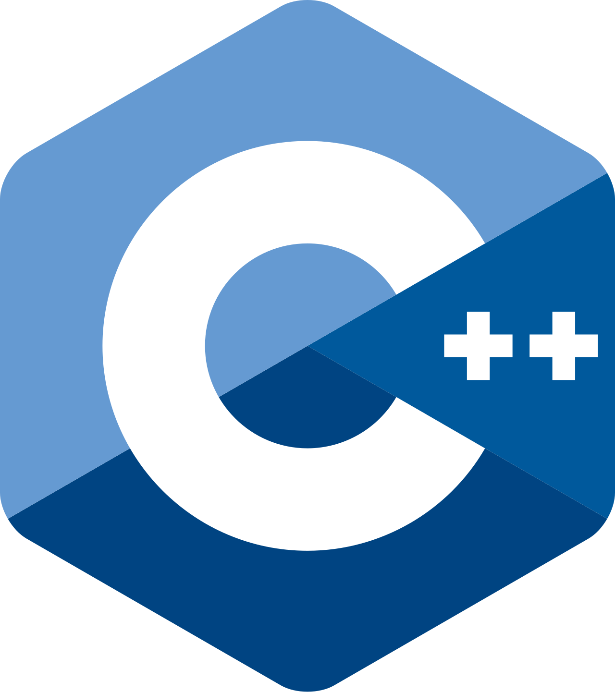

# About Me
Hello, My name is **Nathan Lin**, I am a 3rd year transfer student at the [University of California, San Diego](https://ucsd.edu/). I am majoring in computer Science.

## Hobbies
During my free time, I enjoy playing videogames or playing piano.

### Games I Play
My main interest is <ins>multiplayer games</ins>, I would pretty much play any game that my friends play, but besides that, my **_main_ games** are Tetris or a selection of Rhythm Games ~Mainly PJSK or SDVX~I am also trying to get into dancing games like PIU or DDR.
>I pretty much play any rhythm game, if you are interested in rhythm games or Tetris in general, reach out!
## Programming Experience

MASM

Take a look at how to print "Hello World" in c++!
'''
#include <iostream>

using namespace std;

int main() {
    cout << "Hello World";

    return 0;
}
'''